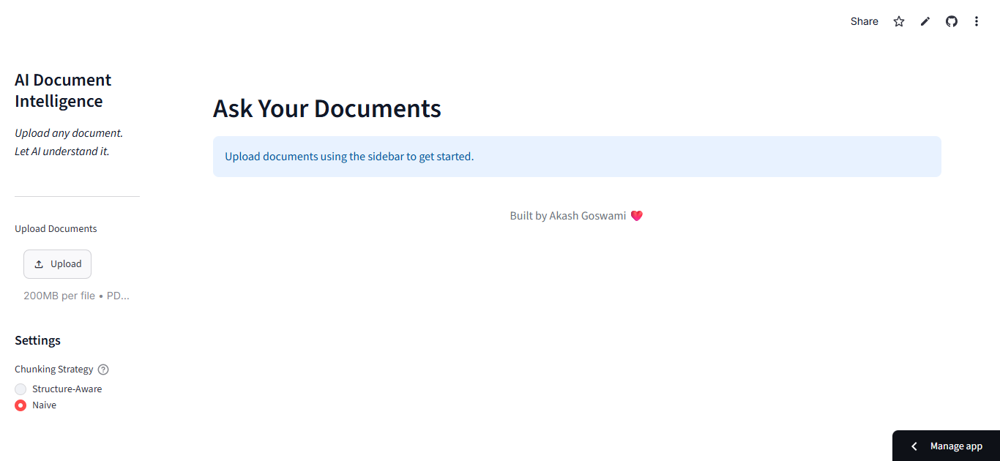
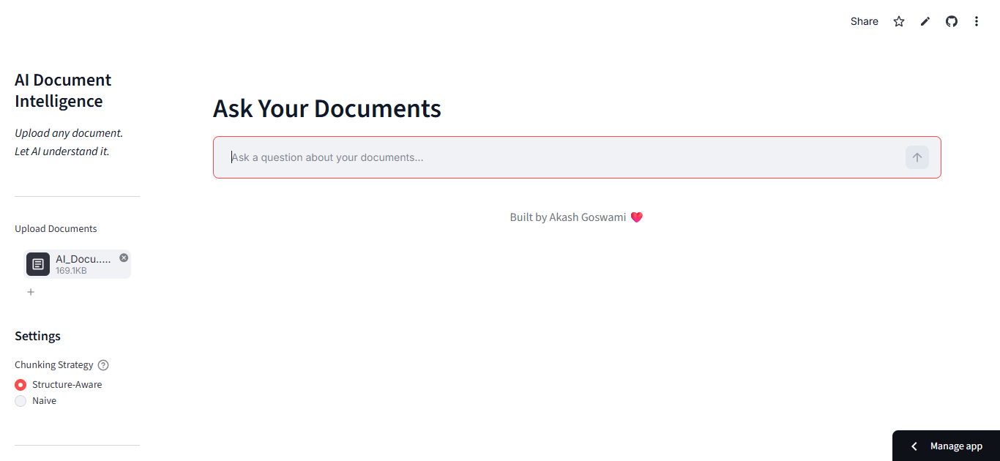
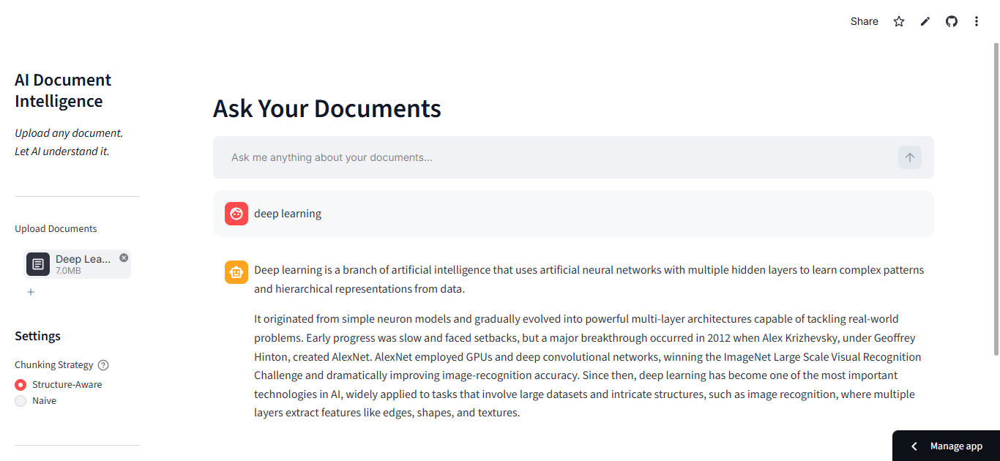
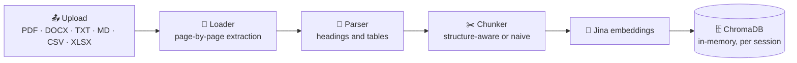
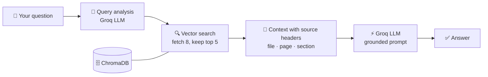

<div align="center">

# 📄🧠 AI Document Intelligence

### *Upload any document. Let AI understand it.*

Chat with your PDFs, Word files, spreadsheets and notes — and get answers **grounded in your own documents**, not in the AI's imagination.

<br/>

[](https://ai-document-intelligence-akash.streamlit.app/)


**[🚀 Live Demo](https://ai-document-intelligence-akash.streamlit.app/)** · **[🎬 Screenshots](#-see-it-in-action)** · **[🧠 How it works](#-how-it-works)** · **[⚡ Quick start](#-quick-start)** · **[📁 Structure](#-project-structure)**

</div>

---

## 🎬 See it in action

<p align="center">
  <b>1️⃣ Start — upload a document from the sidebar</b><br/>
  
</p>

<p align="center">
  <b>2️⃣ Ready — your file is processed and the chat box unlocks</b><br/>
  
</p>

<p align="center">
  <b>3️⃣ Ask — get an answer built from your document</b><br/>
  
</p>

---

## ✨ What is this?

**AI Document Intelligence** is a **Retrieval-Augmented Generation (RAG)** web app. Instead of asking an AI to answer from memory, it first **finds the most relevant passages in your files** and then asks the language model to answer **using only those passages**.

> 🧩 Your files → smart chunks → vectors → search → grounded answer

If the answer isn't in your documents, the app is instructed to say so instead of making something up.

---

## 🚀 Features

| | Feature | What it means |
|---|---|---|
| 📚 | **6 file formats** | PDF, DOCX, TXT, Markdown, CSV and XLSX in one pipeline |
| ✂️ | **Two chunking strategies** | Switch between *Structure-Aware* and *Naive* right from the sidebar |
| 🧱 | **Table-friendly** | Tables in DOCX / CSV / XLSX are kept together as a single chunk |
| 📍 | **Source-aware chunks** | Every chunk remembers its file, page and section |
| 🛡️ | **Grounded answers** | A strict prompt tells the model to use only the retrieved context |
| 💬 | **Chat with memory** | Remembers the last 10 exchanges for follow-ups |
| 🔒 | **Session isolation** | Every browser session gets its own private vector collection |
| 🗑️ | **Full control** | Remove a single file or clear everything with one click |
| 🧯 | **Graceful errors** | Bad model output or API hiccups show a message instead of crashing |

---

## 🧠 How it works

### 🛠️ Step 1 — Ingestion (when you upload)



### 💬 Step 2 — Question answering (when you ask)



### 🗺️ The journey of a PDF

1. 📤 **You upload** a file — it is read straight into memory (nothing is saved to disk).
2. 📖 **The loader** extracts text page by page (`pypdf` for PDFs).
3. 🧩 **The parser** finds headings (`# Title`, `ALL CAPS`, `1.1 Numbered`) and tables.
4. ✂️ **The chunker** cuts the text into ~1000-character pieces with 200 characters of overlap.
5. 🔢 **Jina** turns every chunk into a vector (a list of numbers that captures meaning).
6. 🗄️ **ChromaDB** stores the vectors plus metadata in memory.
7. 💬 **You ask a question** — it is embedded, matched against the stored vectors, and the best 5 chunks go to the LLM.
8. ✅ **Groq** writes the answer using only those chunks.

<details>
<summary><b>🔬 Under the hood — the numbers</b></summary>

<br/>

| Setting | Value |
|---|---|
| Chunk size / overlap | `1000` / `200` characters (configurable) |
| Splitter separators | paragraph → line → sentence → space |
| Chunks fetched / kept | `8` / `5` (`TOP_K` is configurable) |
| Chat memory | last `10` exchanges |
| Metadata per chunk | `chunk_id`, `document_id`, `file_name`, `document_type`, `page_number`, `section`, `chunking_strategy` |
| Vector store | ChromaDB, in-memory, one collection per session (`documents_<uuid>`) |
| Embeddings | Jina AI, one request per upload |

</details>

---

## ✂️ Two ways to chunk

Pick one in the sidebar under **⚙️ Settings → Chunking Strategy**.

| | 🏗️ Structure-Aware *(default)* | 🪓 Naive |
|---|---|---|
| **Splits by** | Each section on its own | Whole document at once |
| **Tables** | One atomic chunk, labelled `[Table: title]` | Split like normal text |
| **Section label** | Real heading (or "Content") | `Unknown` |
| **Page number** | Exact | Estimated |
| **Best for** | Reports, papers, structured docs | Quick baseline / comparison |

> 💡 Chunking is applied when a file is uploaded. To compare strategies, remove the file, switch the radio button, and upload it again.

---

## 🧰 Tech stack

| Layer | Technology |
|---|---|
| 🖥️ **UI** | Streamlit |
| ⚡ **LLM** | Groq |
| 🔢 **Embeddings** | Jina AI |
| 🗄️ **Vector DB** | ChromaDB |
| 🔗 **Orchestration** | LangChain |
| 📖 **Parsing** | pypdf · python-docx · pandas · openpyxl |
| 🧱 **Data models** | Pydantic v2 |
| ⚙️ **Config** | python-dotenv |

---

## 📁 Project structure

```text
AI-Document-Intelligence/
│
├── 📄 app.py                    # Streamlit UI + pipeline orchestration
├── 📄 requirements.txt          # Python dependencies
├── 📄 README.md                 # You are here
├── 🔐 .env                      # API keys (never committed)
│
├── 🖼️ assets/                   # README screenshots
│   ├── app-home.png
│   ├── app-ready.png
│   └── app-answer.png
│
├── 📂 data/
│   └── uploads/                 # Reserved (files are processed in memory)
│
└── 📂 src/
    ├── models.py                # Pydantic data contracts (pages, sections, chunks, results)
    ├── document_loader.py       # Per-format extraction (PDF, DOCX, TXT, MD, CSV, XLSX)
    ├── parser.py                # Heading detection, sections, tables
    ├── chunker.py               # Naive + structure-aware chunking
    ├── embeddings.py            # Embedding factory
    ├── jina_embeddings.py       # Jina AI embedding client
    ├── vector_store.py          # ChromaDB wrapper (add, search, delete, reset)
    ├── query_analyzer.py        # LLM query understanding (safe JSON parsing + fallback)
    ├── retriever.py             # Analysis → filter → similarity search → results
    ├── rag_chain.py             # Prompt + LLM + conversation memory
    ├── prompts.py               # All prompt templates
    └── llm.py                   # Groq LLM factory
```

---

## ⚡ Quick start

###  Clone

```bash
git clone https://github.com/akashgoswami139/AI-Document-Intelligence.git
cd AI-Document-Intelligence
```


## 🗣️ Try asking

- 🔎 *"What is the main idea of this document?"*
- 📅 *"Which year did the breakthrough happen, and who was behind it?"*
- 🧾 *"What are the payment terms?"*
- 📊 *"What columns does this spreadsheet have?"*
- 🙅 *"Something the document doesn't cover"* → the app should politely say it can't find it

---

## 🚧 Honest limitations

Being upfront about what this project does **not** do (yet):

- 🧠 **Session-only memory** — vectors live in RAM; refresh the page and you upload again
- 🖨️ **No OCR** — scanned / image-only PDFs have no text to read
- 📑 **PDF tables** are read as plain text (table detection works for DOCX / CSV / XLSX)
- 📎 **No on-screen citations yet** — chunks carry file / page / section metadata, but answers don't display them
- 🔄 **Follow-ups** use the raw question for retrieval (no query rewriting yet)
- 📈 **Aggregations** like "total of column X" are not reliable — RAG retrieves passages, it doesn't compute over tables
- 🔐 **Privacy** — document text is sent to the embedding and LLM providers; don't upload confidential files to the demo

---

## 🛣️ Roadmap

- [ ] 📎 Show sources (file · page · section) under every answer
- [ ] 🧪 Build a small evaluation set (hit-rate@k, answer correctness)
- [ ] 🔀 Hybrid search (BM25 + vectors) and a reranker
- [ ] 🖨️ OCR for scanned PDFs
- [ ] 🗄️ Persistent vector store (Qdrant / pgvector)
- [ ] 🔁 Rewrite follow-up questions into standalone queries
- [ ] 🏷️ Bring back automatic document classification
- [ ] ⚡ Streaming answers

---

## 👨‍💻 Author

**Akash Goswami** — AI / ML engineering student who builds with LLMs, RAG and Python.

🐙 [GitHub](https://github.com/akashgoswami139)

---

<div align="center">

### ⭐ If this project helped you, drop a star!

Built with ❤️ by **Akash Goswami**

</div>
